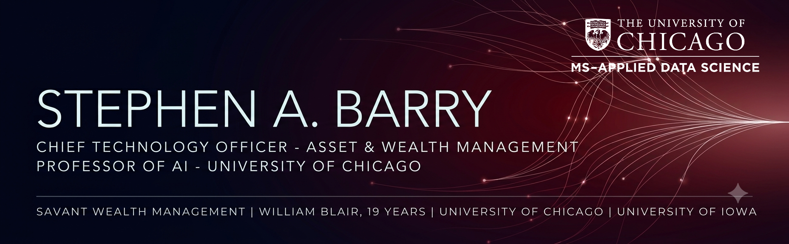

### Head of Data &amp; Technology (CTO scope) &amp; Member Owner — Savant Wealth Management

25+ years in financial services technology — and still the person who architects the platform. I own technology strategy, the AI roadmap, cyber posture, and M&A integration at a PE-sponsored RIA that has grown from **$28B to $61B in AUM since April 2024**, and I carry that story to the board, to the firm's private equity sponsor, and to CEOs across the sponsor's portfolio. Lecturer at the University of Chicago Data Science Institute.

---

## Value delivered

- **2x scale-up under PE sponsorship** — $28B → $61B AUM since April 2024. I own the technology that makes each successive acquisition faster to onboard, cheaper to run, and more accretive.
- **$250M+ in attributable revenue** — architected the AI-driven M&A buyer/seller scoring system at William Blair (FY2022), alongside one of the first production LLM deployments in U.S. investment banking.
- **+25% advisor productivity** — AI meeting-notetaking rolled out across the advisor force, ~4,000 transcripts processed by AI agents, and the co-advisor staffing model retired on most accounts.
- **Zero security breaches** during tenure, down from ~8 per year — while AUM more than doubled and acquisition cadence accelerated.
- **17 apps → 1 workspace** — advisor workspace consolidation live in pilot on real advisor and client data, with a roadmap of 192 planned AI agents across advisory, operations, and growth.
- **2x qualified leads on the same ad budget** — look-alike and lead-prediction models behind 8.0% organic growth, with Epsilon big-data audience matching in production.

---

## How I work

| As a CTO | As a builder |
| --- | --- |
| Enterprise technology strategy and roadmap ownership | Architecting a federated AI platform for wealth management |
| Board and PE-sponsor reporting; EBITDA-aware investment decisions | Medallion lakehouse on Microsoft Fabric and Snowflake |
| M&A technology due diligence and post-close integration | Agentic AI workflows, MLOps, AI governance, prompt engineering |
| Cyber risk, SEC/FINRA/SOX compliance, DR and resiliency | Governed API integration across Salesforce, Tamarac, eMoney, Jump AI |
| Strategic vendor negotiation and TCO across cloud, data, security, AI | Cloud migration and FinOps — 95% cloud and 60% PaaS adoption delivered |
| Built and led teams of 20 to 50+ engineers, scientists, architects | Still hands on the data, the cloud, and the architecture |

---

## Stack

---

## Credentials

**MS, Applied Data Science** — University of Chicago · **BA, History** — University of Iowa
**CISSP** · **CCSP** · **CCSK** · **Azure AI Engineer Associate** · **AWS Solutions Architect – Associate** · **MCSE / MCSD Azure**

## Teaching &amp; thought leadership

**Lecturer, University of Chicago Data Science Institute** — MS in Applied Data Science, joint with Booth. Data Engineering for Data Science, Big Data, Cloud Scalable Data Platforms, and Robotics, including hands-on Databricks and Snowflake.

Microsoft Synapse &amp; Power BI Advisory Boards (2021–2024) · WEKA Titans of AI · P33 Chicago Tech Week AI/ML panel · William Blair LLM Speaker Series · Informatica World · UChicago faculty panels at DSI, Booth, and the Graham School

---

Generative AI in financial services since GPT-2 early access. Currently building the platform that compounds advisor productivity at scale.
